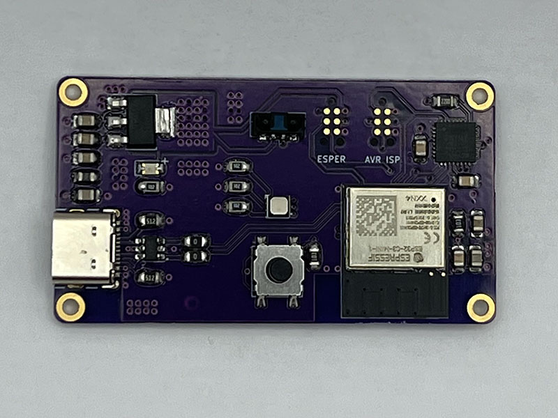
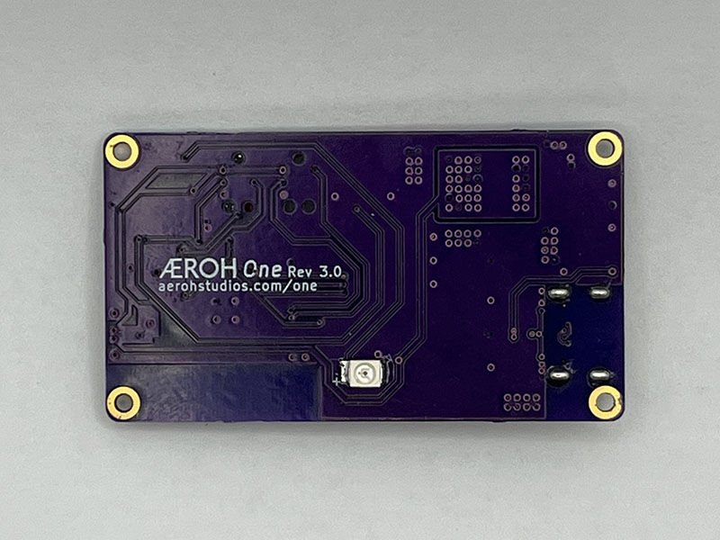

# Aeroh One

Internet Connected Infrared Remote for Alexa, Google Assitant, Apple Homekit (Siri) &amp; IFTTT integration

## Description

The Aeroh One is for the lazy people, the exhausted ones who can't be bothered to turn on their fans because they have to get out of the couch.

Aeroh One is an internet-connected device that turns your tower fan into a smart fan. You can either use our mobile app or simply integrate it into your Alexa, Google Assistant, Siri, or IFTTT. And at 10th the price of a smart fan.

It doesn't end there. Aeroh One can work with a wide range of tower fans in the market and it's adaptable to work with any device that can be controlled with remote control. Yes, even with your old TV.

Aeroh One has a small footprint; it mounts on top of the infra-red remote receiver of your equipment and is programmed to emit the remote signals based on what your equipment can understand. We have a wide range of mounting options that you can either order or freely download the 3D models and print yourself if you have access to a 3D printer.

Moreover, You can still use your OEM remote while Aeroh One is mounted on the equipment. This is because Aeroh One has an infra-red remote receiver in the front, and it can proxy the signals that it receives.

With this infra-red remote receiver, you can also record custom infra-red signals and program the Aeroh One to work with new equipment.

With Aeroh One, make your smart home smarter, and that too without breaking your bank!

## Photo Gallery

### Enclosure

**Front of the enclosure with IR Receiver Window, Status LED window and control button**

**Back of the enclosure with IR Emitter**

**USB-C Port for Power & Debugging**

### PCB

**Front of the PCB with IR Receiver, Status LED, control button**

**Back of the PCB with IR Emitter**

## Directory Structure

- `/case`: CAD Files for printing the enclosure or assist with custom mounts for the enclosure
- `/code`: Firmware for the Wireless Connectivity, Infrared Remote Rx/Tx, and Mobile Apps
- `/pcb`: Gerber files and schematic for PCB design and production1
