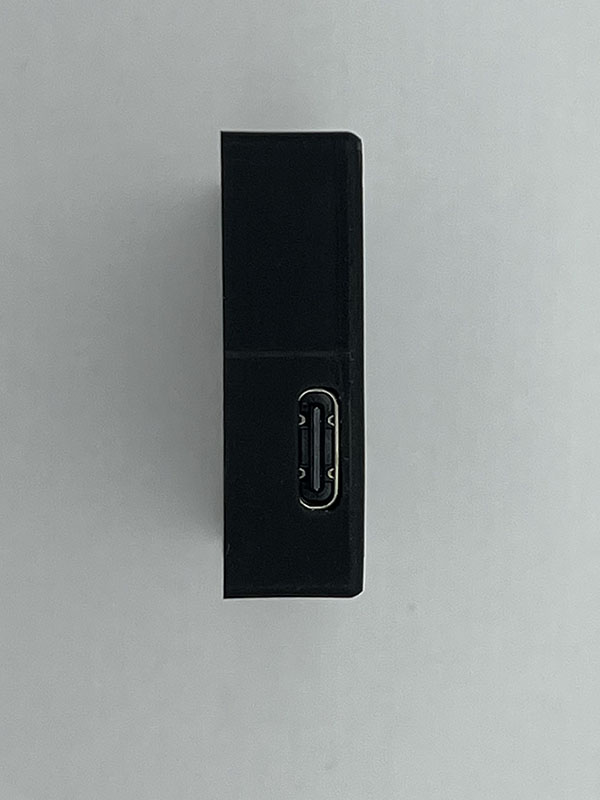

# Aeroh One

Internet Connected Infrared Remote for Alexa, Google Assitant, Apple Homekit (Siri) &amp; IFTTT integration

## Directory Structure

- `/case`: CAD Files for printing the enclosure or assist with custom mounts for the enclosure
- `/code`: Firmware for the Wireless Connectivity, Infrared Remote Rx/Tx
- `/pcb`: Gerber files and schematic for PCB design and production

## Photo Gallery

### Enclosure

**Front of the enclosure with IR Receiver Window, Status LED window and control button**

**Back of the enclosure with IR Emitter**

**USB-C Port for Power & Debugging**

### PCB

**Front of the PCB with IR Receiver, Status LED, control button**

**Back of the PCB with IR Emitter**

