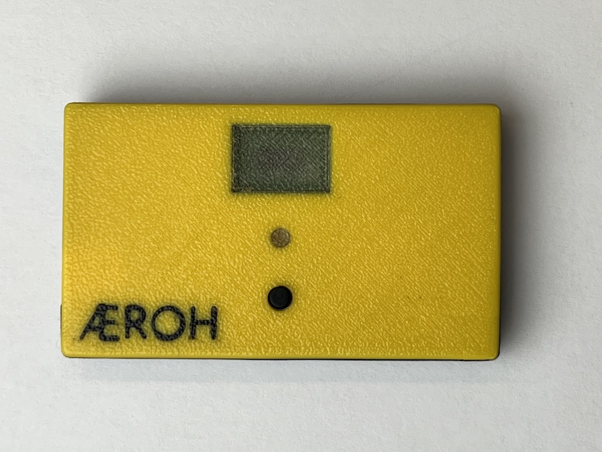
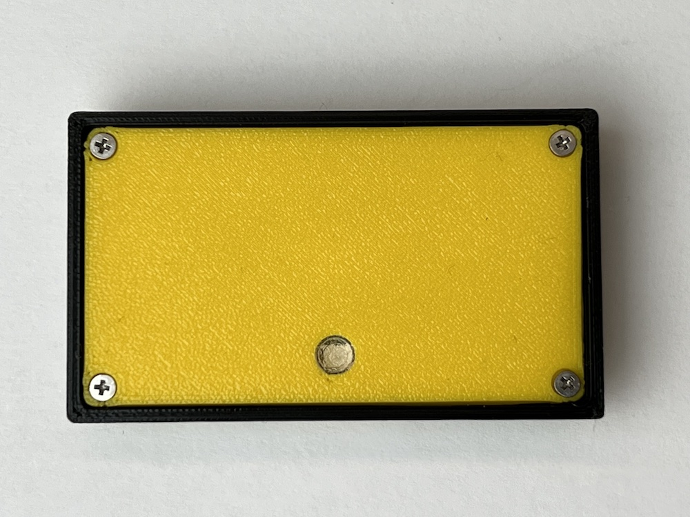
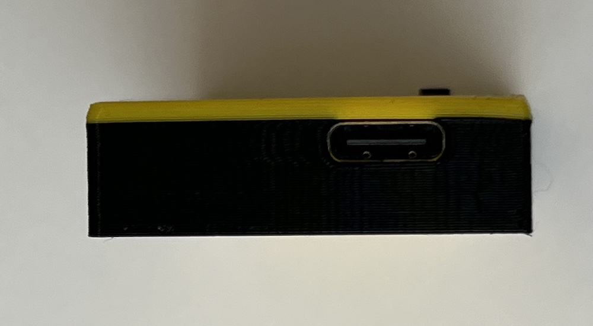

# Aeroh Link Enclosure Files

Aeroh Link Enclosure has two seperate parts -- Front, and Back. You can find respective files in `back_panel` and `back_panel` directories.

These are multipart files, so you will have to import them as multi part files in to your Slicer software, and the parts should align themselves properly.

## Support

Please feel free to create a Github issue if you need help or facing challenges. 

## Contribute

User contributions are welcome. Please upload files in `.3mf` format, and a photo (`.jpg`, under 300KB) of the enclosure.

## Photos

**Front**

**Back**

**USB Slot**

