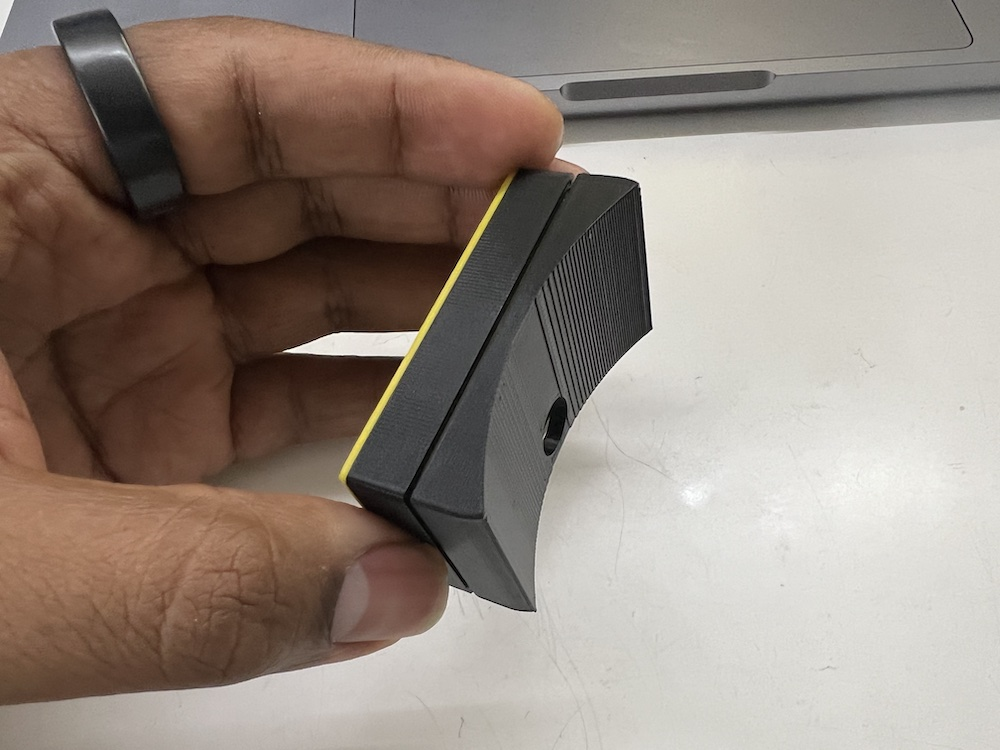
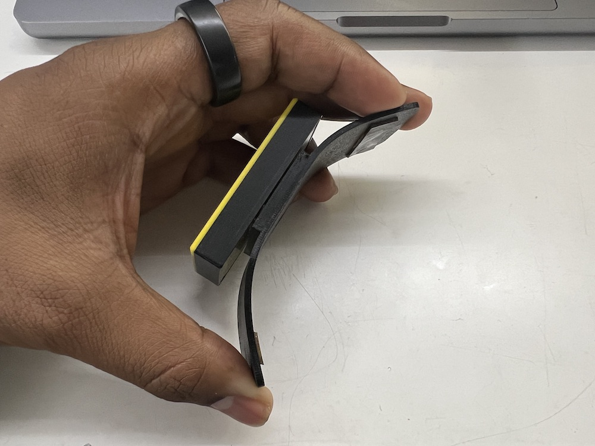
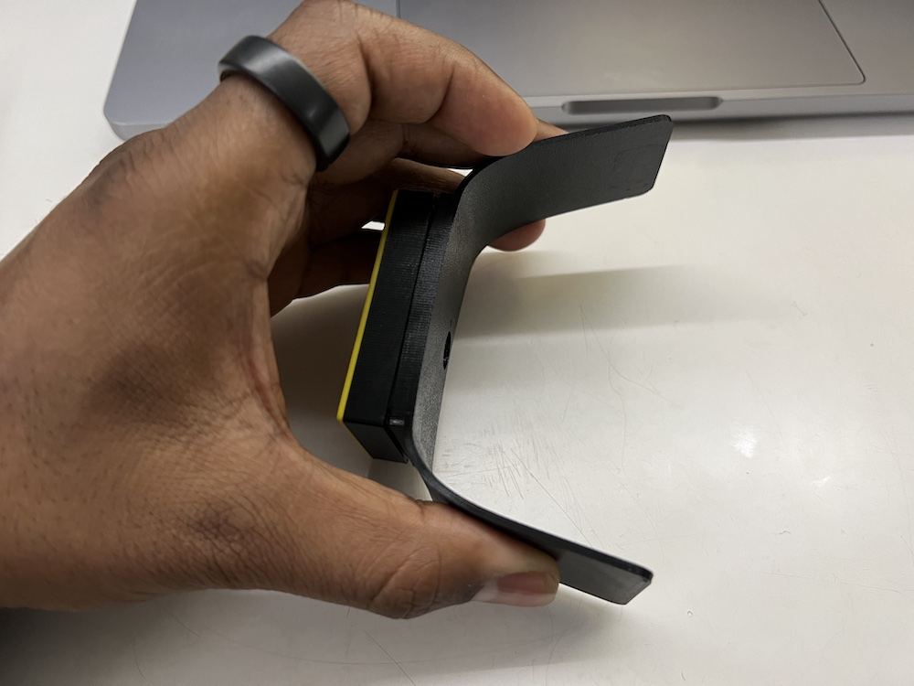

# Aeroh Link Mounting Adapter

Different types of mounting adapters for Aeroh Link to support various types surfaces. 

Here are some examples:

1. Rigid Mount for Tower Fans

2. Flex Mount with Small Footprint

3. Flex Mount with Large Footprint

Flex Mounts are very versatile. Here are some tips on how to print them:

1. Print flex mounts with a flexible matrial like TPU. We tried [SainSmart Black TPU](https://www.amazon.com/SainSmart-Flexible-Printing-Filament-Dimensional/dp/B00TI3JUTM/) and it was easy to print with, and we were happy with the print quality.
2. Our flex mounts are multi part designs, so that you can mix and match materials. Import them as multipart print into your slicer, and they should align themselves properly.

## Support

Please feel free to create a Github issue if you need help or facing challenges. 

## Contribute

User contributions are welcome. Please upload files in `.3mf` format, and a photo (`.jpg`, under 300KB) of the mount.
